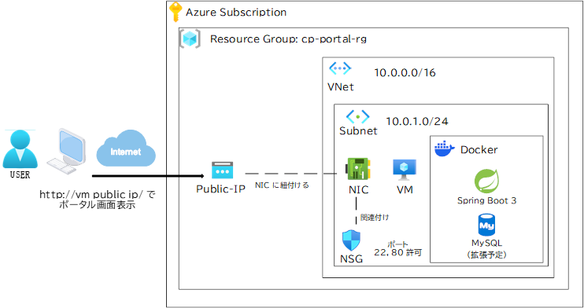
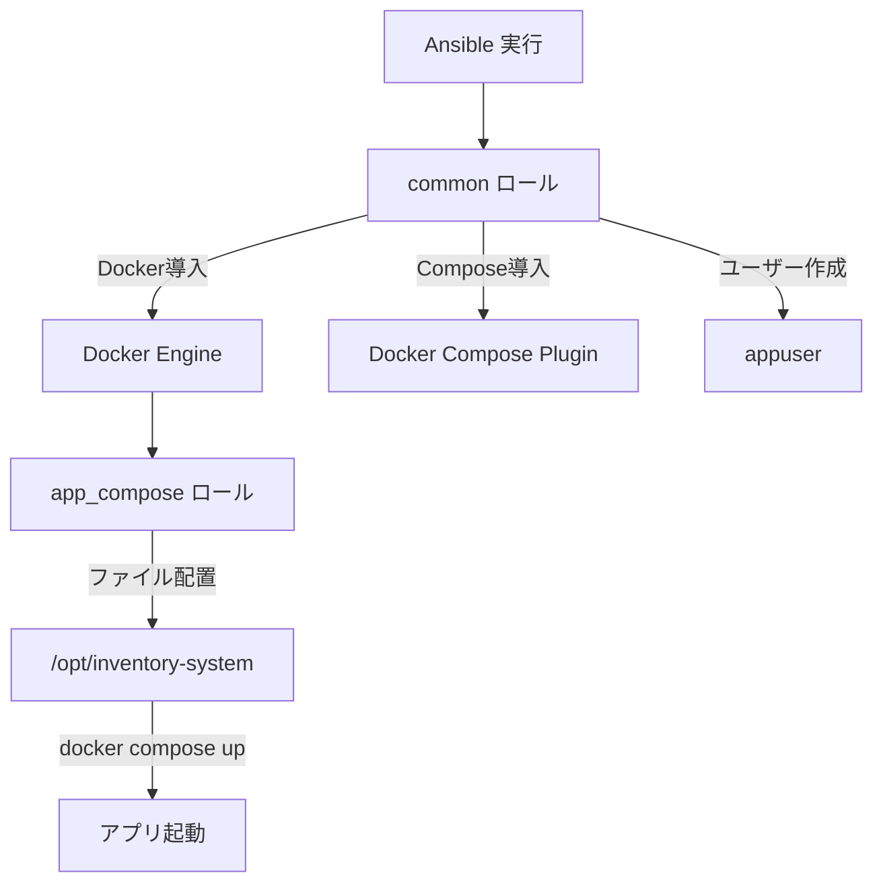

# 商品在庫管理システム (Inventory System)
Java / Spring Boot / MySQL / Docker / Terraform / Ansible を組み合わせて構築した、  
シンプルな **商品在庫管理システム** です。  
ポートフォリオとして、バックエンド開発と IaC (Infrastructure as Code) の構成になっています。

---

## 1. 機能概要

- ログイン / ログアウト機能
  - シンプルなユーザー認証（ユーザー名＋パスワード）
- ダッシュボード
  - ログイン後に表示されるトップ画面
  - 登録されている商品の在庫一覧を表示
- 商品管理機能
  - 新規商品登録
    - 商品名・カテゴリ・価格・初期在庫数を入力して登録
    - 商品ごとに一意の ID が自動採番される
  - 在庫編集
    - 在庫数 / 価格 / カテゴリなどを編集可能
  - 商品削除

---
## 2. 使用技術

### アプリケーション

- 言語: Java 21
- フレームワーク: Spring Boot 3
  - Spring Web (MVC)
  - Thymeleaf
- ビルドツール: Maven 
- データベース: MySQL 8
- フロントエンド: HTML / CSS (Thymeleaf テンプレート)

### インフラ / IaC

- コンテナ: Docker, Docker Compose
- クラウド: Microsoft Azure
- IaC:
  - Terraform: Azure リソース (Resource Group / VNet / Subnet / Public IP / NIC / Linux VM) の作成
  - Ansible: Linux VM 上の構成管理
    - Git / Docker / Docker Compose のインストール
    - アプリケーションリポジトリの取得
    - `docker compose up` によるアプリケーション起動

---
## 3. ディレクトリ構成
###　app
```text
app-backend   # このプロジェクトの「バックエンド（Spring Boot）」側ルート
│  Dockerfile  # バックエンドをDockerイメージ化するための設計図
│  pom.xml   # Mavenの設定ファイル（依存関係・ビルド方法の定義）
│
├─src
│  └─main  # （Maven標準）メインのソース置き場
│      ├─java   # Javaソースコード置き場
│      │  └─com   # パッケージ階層（企業/組織の逆ドメイン）
│      │      └─example
│      │          └─inventory  # アプリ本体のトップパッケージ（在庫管理アプリ）
│      │              │  InventorySystemApplication.java  # Spring Bootの起動クラス（mainメソッド）
│      │              │                                   
│      │              ├─config    # 設定系（アプリ全体のルール・共通設定）
│      │              │      AuthInterceptor.java # 画面アクセス前に「ログイン済みか」を判定する仕組み（横断処理）
│      │              │                           
│      │              │      WebConfig.java    # Spring MVCの設定クラス
│      │              │                            
│      │              │      CryptoConfig.java  # BCryptなどの暗号化（ハッシュ化）部品をBean登録する設定                  
│      │              │      
│      │              │                         
│      │              ├─controller  # 画面やURLの入口（HTTPリクエストを受ける層）
│      │              │      AuthController.java   # ログイン画面表示（GET /login）ログイン処理/ログアウト
│      │              │                            
│      │              │      ProductController.java # 在庫（商品）画面のコントローラ                      
│      │              │                                   
│      │              │                             
│      │              ├─entity  # DBのテーブルと対応する「入れ物」（JPAエンティティ）
│      │              │      Product.java  # products テーブルに対応するデータ構造
│      │              │                    
│      │              │      User.java  # users テーブルに対応するデータ構造
│      │              │                 
│      │              ├─repository    # DBアクセス（SQL発行）担当（Spring Data JPA）
│      │              │      ProductRepository.java  # Product用のDB操作（findAll/save/delete等）を提供
│      │              │                             
│      │              │      UserRepository.java  # User用のDB操作（findByUsername等）を提供
│      │              │                           
│      │              └─service    # 業務ロジック層（処理の中心・コントローラとDBの間）
│      │                      ProductService.java # 商品の取得・保存・削除などの処理をまとめる場所
│      │                                          
│      │                      UserService.java  # ログイン認証やユーザー登録の中心
│      │                                        
│      │                                        
│      └─resources # Javaコード以外の「設定・画面・静的ファイル」を置く場所（Spring Bootが自動で読み込む）
│          │  application.yml  # アプリの設定ファイル（環境設定の中心）
│          │                                
│          │               
│          ├─static     # そのままブラウザに配信される「静的ファイル」置き場
│          │  └─css
│          │          style.css  # 画面デザイン用CSS
│          │
│          └─templates  # ThymeleafのHTMLテンプレート置き場（サーバ側でレンダリングされる画面）
│                  dashboard.html    # 在庫一覧画面（ダッシュボード）
│                  login.html        # ログイン画面
│                  product-form.html # 商品の「新規登録/編集」共通フォーム画面
```
### terraform
```text
├─ terraform/              # Azure インフラ（VM / VNet / Subnet / NSG / Public IP）
│   ├─ provider.tf     # どのプロバイダーを使用するか
│   ├─ main.tf　　　　　# VM / VNet / Subnet / NSG / Public IP 設定
│   ├─ variables.tf    # 変数定義ファイル
│   ├─ outputs.tf　　　# Public IPとSSH接続コマンド出力
│   └─ terraform.tfvars.example　# 変数の値　設定
```
### ansible
```text
ansible/  # Ansible一式（このフォルダで構築を実行）
│  ansible.cfg # Ansibleの基本設定（SSHユーザー、鍵、ログ、sudo設定など）
│  inventory.ini # 対象サーバ一覧（接続先IP/ホスト名、グループ、変数）
│  site.yml # 全体の入口Playbook（どのroleをどの順で実行するか）
│
└─roles/ # 役割ごとの部品
    ├─app_compose/ # アプリ＋DBなどのDocker Compose配備用ロール
    │  ├─files/ # サーバへ配る静的ファイル置き場
    │  │      .env # Composeの環境変数（DBパスワード等）※本来は秘匿管理未設定
    │  │      app.jar # Spring Bootなどの成果物
    │  │      docker-compose.yml # アプリ用compose（app/dbなどの定義）
    │  │      Dockerfile # appイメージ作成用（app.jarを組み込む）
    │  │
    │  └─tasks/
    │          main.yml # app_composeで実行する処理本体（配置→build→up等）
    │
    └─common/  # 共通セットアップ用ロール（全サーバ共通）
        ├─files
        │      docker-compose.yml # 共通で使うcompose（例: 監視/共通サービス等があれば）
        │
        └─tasks
                main.yml # commonで実行する処理（Docker導入、ユーザー設定等）
```
## 4. Azureシステム構成図
<br>
<a target="_blank" href="https://icons8.com/icon/90519/spring-boot">春のロゴ</a> アイコン by <a target="_blank" href="https://icons8.com">Icons8</a>

## 5. 実行手順
### 1. ローカル開発環境での実行
#### ビルド & 起動
##### ビルド＆起動をデタッチモードで
docker compose up -d --build
##### ビルドのみ
docker compose  build
##### 停止
docker compose down
##### サービス名を指定してログ確認
docker compose logs -f app

docker compose logs -f worker

docker compose logs db

### 2. Terraformによる構築手順（Azure）
Azure CLI 認証
#### 2.1 Terraform ディレクトリへ移動
cd terraform
#### 2.2 Azure CLI でログイン
az login
#### 2.3 使いたいサブスクリプションを選択（必要なら）
##### サブスクリプションのテーブル表示
az account list --output table
##### サブスクリプションのIDを指定して設定
az account set --subscription "SubscriptionId"
##### 現在設定しているサブスクリプションを表示
az account show --output table
#### 2.4 初期化＆実行
##### 初期化
terraform init
##### プラン表示
terraform plan
##### そのプランを実行
terraform apply
確認プロンプトに：yes と入力
##### 出力確認（Outputs）
自動設定されたパブリックIPアドレス<br>
vm_public_ip = "20.xxx.xxx.xxx"<br>
SSH接続用のコマンド<br>
ssh_example  = "ssh azureuser@20.xxx.xxx.xxx"

## Azure アーキテクチャ概要
Terraform で作成した Azure リソースと、Docker 上で動作するアプリケーション構成の対応関係は次の通りです。

- `azurerm_resource_group.rg` … `inventory-system-rg`
- `azurerm_virtual_network.vnet` … `inventory-system-vnet`
- `azurerm_subnet.subnet` … `inventory-system-subnet (10.0.1.0/24)`
- `azurerm_network_security_group.nsg` … `inventory-system-nsg`
- `azurerm_public_ip.public_ip` … `inventory-system-pip`
- `azurerm_network_interface.nic` … `inventory-system-nic`
- `azurerm_linux_virtual_machine.vm` … `inventory-system-vm`（Ubuntu 22.04 上で Docker / Docker Compose を実行）

#### 2.6 リソース削除（destroy）
terraform destroy
確認プロンプトで：yes と入力
### 3. Ansible による構築手順（Azure VM）
Terraform によって作成された Azure VM に対して設定を行う。

#### 3.1 Terraform で Public IP の確認
cd inventory-system/terraform<br>
terraform output
#### 3.2 inventory.ini の設定
[web]
inventory-vm ansible_host=パブリックIPアドレス
#### WSLの Linux 側に ansible フォルダを移す
mkdir -p ~/ansible<br>
cp -r /mnt/c/Users/PC_User/Desktop/inventory-system/ansible/* ~/ansible/
#### 3.3 Ansible 接続テスト
ansible cp_portal -m ping
#### 3.4 Ansible 実行（初期設定＋Docker環境構築）
ansible-playbook site.yml
#### 3.5 Docker コンテナ起動確認
ssh azureuser@PublicIP <br>
sudo docker ps
#### 3.6 Web アクセス確認
http://パブリックIPアドレス
